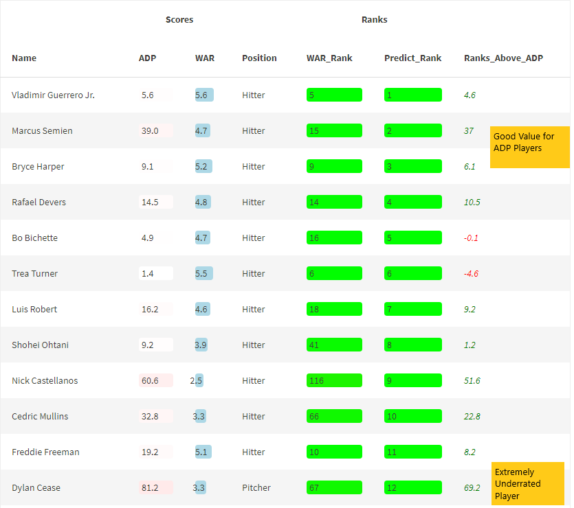

<html>

<p>

Projections using Hypertuned model through XGboost

</p>

<p>

All data is from [FanGraphs.](https://www.fangraphs.com/) I have no affiliation with FanGraphs, but please consider contributing to their [website](https://plus.fangraphs.com/shop/) if you found this project informative.

</p>

```{r setup, include=FALSE}
knitr::opts_chunk$set(echo = TRUE)
knitr::opts_knit$set(root.dir = 'C:/Users/Admin/Documents/Learning Python Folder1/Python Essence Training/Fantasy-Baseball/Data')
options(knitr.table.format = "html") 
options(digits=2)
options(scipen = 100)
```


# Project Scope {.tabset}

## Objective

This project is designed to showcase how Using a Percentile Based Worth System values Fantasy Baseball Players through a Inning Pitched (IP) weighted projection

After Running the Pitching Specific and Hitting Specific models we can consolidate the results




# Total 5x5 Rankings {.tabset}
## 5X5 Data Prep
```{r}


Pitching_Data_Adj_Projections5x_Total =
Pitching_Data_NonAdj_Projections5x %>% 
  mutate(
    Avg_IP = 60,
    Adj_factor = 0.90,
    AdjPredict_Score_raw = ifelse(is.na(Predict_Score),NA,(Predict_Score*(IP/Avg_IP)))/Adj_factor,
    Position = 'Pitcher'
  ) %>% select (Name,ADP,WAR,AdjPredict_Score_raw,Position)


hitting_Data_Adj_Projections5xb_Total =
hitting_Data_NonAdj_Projections5xb %>% 
  mutate(
    Avg_PA = 300,
    AdjPredict_Score_raw = ifelse(is.na(Predict_Score),NA,Predict_Score*(PA/Avg_PA)),
    Position = 'Hitter'
  ) %>% select (Name,ADP,WAR,AdjPredict_Score_raw,Position)


Final5xa = rbind(Pitching_Data_Adj_Projections5x_Total,hitting_Data_Adj_Projections5xb_Total) 


Final5xb = Final5xa %>% 
  arrange(desc(AdjPredict_Score_raw)) %>% 
  mutate(
    max_predscore= max(AdjPredict_Score_raw,na.rm = T),
    WAR_rank = order(order(rank(WAR,ties.method = 'average'),decreasing = TRUE)),
    AdjPredict_Score = ifelse (is.na(AdjPredict_Score_raw),NA,AdjPredict_Score_raw *100/max_predscore),
    AdjPredict_Score_Rank = order(order(rank(AdjPredict_Score,ties.method = 'average'),decreasing = TRUE))-sum(is.na(AdjPredict_Score)), 
    Ranks_Above_ADP = ADP - AdjPredict_Score_Rank
  ) %>% select(-max_predscore,-AdjPredict_Score_raw,-AdjPredict_Score)

Final5x = na.omit(Final5xb)


```


------------------------------------------------------------------------

## Table of Projections (Players who Didn't Play in 2021 are Excluded)

AdjPredict_Score are normalized to 100


```{r}


ft_dt <- Final5x[1:nrow(Final5xb), 1:ncol(Final5x)] %>% 
  filter(AdjPredict_Score_Rank>0)%>%  arrange((AdjPredict_Score_Rank))

ft_dt$ADP <- color_tile("white", "red")(ft_dt$ADP)

ft_dt$WAR <- color_bar("lightblue")(ft_dt$WAR)

ft_dt$WAR_Rank <- color_tile("green","orange")(ft_dt$WAR_rank)

ft_dt$Predict_Rank <- color_tile("green","orange")(ft_dt$AdjPredict_Score_Rank) 


ft_dt$Ranks_Above_ADP <- 
  ifelse(
  ft_dt$Ranks_Above_ADP < 0,
  cell_spec(round(ft_dt$Ranks_Above_ADP,2), color = "red", italic = T),
  cell_spec(round(ft_dt$Ranks_Above_ADP,2), color = "green", italic = T)
)


ft_dt2 <- ft_dt[c("Name", "ADP", "WAR","Position", "WAR_Rank","Predict_Rank","Ranks_Above_ADP")]


table_export = 
kbl(ft_dt2, escape = F) %>% 
 kable_material(c("striped", "hover","condensed","responsive"),full_width = F,fixed_thead = T) %>%   column_spec(6, width = "3cm") %>%
  add_header_above(c(" ", "Scores" = 2," ", "Ranks" = 2," "))

save_kable(table_export,file = "Total5x5_updated.html")
  
table_export  
```

------------------------------------------------------------------------

# Total 6x6 Rankings {.tabset}
## 6x6 Rankings
```{r}


Pitching_Data_Adj_Projections6x_Total =
Pitching_Data_NonAdj_Projections6x %>% 
  mutate(
    Avg_IP = 60,
    Adj_factor = 0.84,
    AdjPredict_Score_raw = ifelse(is.na(Predict_Score),NA,(Predict_Score*(IP/Avg_IP)))/Adj_factor,
    Position = 'Pitcher'
  ) %>% select (Name,ADP,WAR,AdjPredict_Score_raw,Position)


hitting_Data_Adj_Projections6xb_Total =
hitting_Data_NonAdj_Projections6xb %>% 
  mutate(
    Avg_PA = 300,
    AdjPredict_Score_raw = ifelse(is.na(Predict_Score),NA,Predict_Score*(PA/Avg_PA)),
    Position = 'Hitter'
  ) %>% select (Name,ADP,WAR,AdjPredict_Score_raw,Position)


Final6xa = rbind(Pitching_Data_Adj_Projections6x_Total,hitting_Data_Adj_Projections6xb_Total) 


Final6xb = Final6xa %>% 
  arrange(desc(AdjPredict_Score_raw)) %>% 
  mutate(
    max_predscore= max(AdjPredict_Score_raw,na.rm = T),
    WAR_rank = order(order(rank(WAR,ties.method = 'average'),decreasing = TRUE)),
    AdjPredict_Score = ifelse (is.na(AdjPredict_Score_raw),NA,AdjPredict_Score_raw *100/max_predscore),
    AdjPredict_Score_Rank = order(order(rank(AdjPredict_Score,ties.method = 'average'),decreasing = TRUE))-sum(is.na(AdjPredict_Score)), 
    Ranks_Above_ADP = ADP - AdjPredict_Score_Rank
  ) %>% select(-max_predscore,-AdjPredict_Score_raw,-AdjPredict_Score)

Final6x = na.omit(Final6xb) %>% filter(AdjPredict_Score_Rank >0)
```


------------------------------------------------------------------------

## Table of Projections (Players who Didn't Play in 2021 are Excluded)

AdjPredict_Score are normalized to 100


```{r}


ft_dt <- Final6x[1:nrow(Final6xb), 1:ncol(Final6x)] %>% 
  filter(AdjPredict_Score_Rank>0)%>%  arrange((AdjPredict_Score_Rank))

ft_dt$ADP <- color_tile("white", "red")(ft_dt$ADP)

ft_dt$WAR <- color_bar("lightblue")(ft_dt$WAR)

ft_dt$WAR_Rank <- color_tile("green","orange")(ft_dt$WAR_rank)

ft_dt$Predict_Rank <- color_tile("green","orange")(ft_dt$AdjPredict_Score_Rank) 


ft_dt$Ranks_Above_ADP <- 
  ifelse(
  ft_dt$Ranks_Above_ADP < 0,
  cell_spec(round(ft_dt$Ranks_Above_ADP,2), color = "red", italic = T),
  cell_spec(round(ft_dt$Ranks_Above_ADP,2), color = "green", italic = T)
)


ft_dt2 <- ft_dt[c("Name", "ADP", "WAR","Position", "WAR_Rank","Predict_Rank","Ranks_Above_ADP")]


table_export = 
kbl(ft_dt2, escape = F) %>% 
 kable_material(c("striped", "hover","condensed","responsive"),full_width = F,fixed_thead = T) %>%   column_spec(6, width = "3cm") %>%
  add_header_above(c(" ", "Scores" = 2," ", "Ranks" = 2," "))

save_kable(table_export,file = "Total6x6_updated.html")
  
table_export  
```


